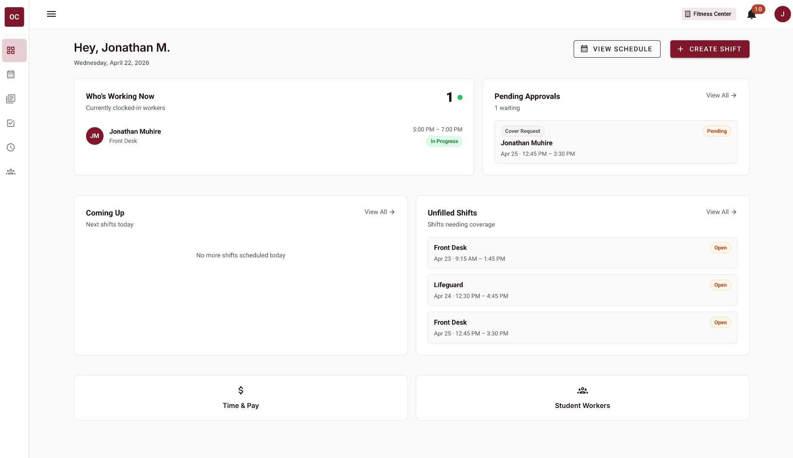
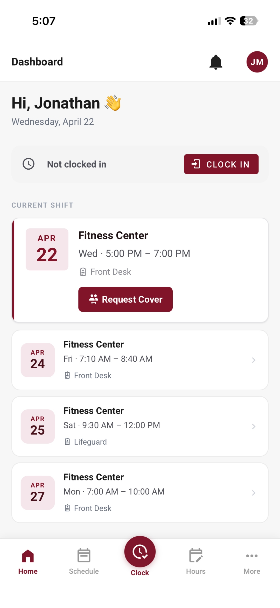
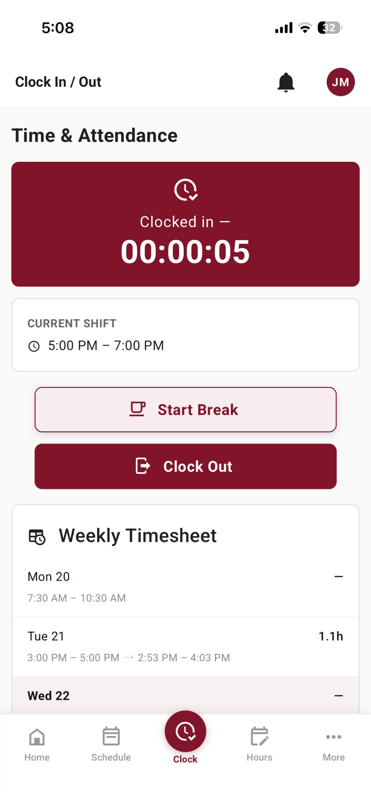
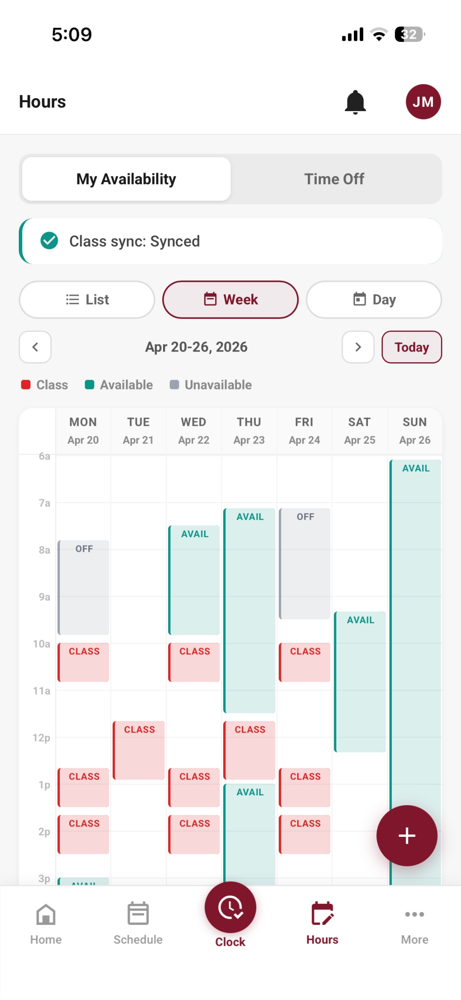
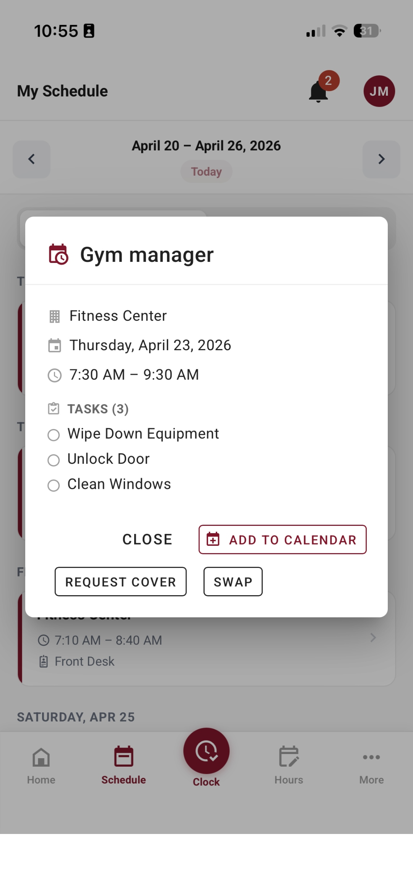

# SWS — Student Work Scheduling System (Frontend)

SWS is the Student Work Scheduling System for Oklahoma Christian University. Managers create shifts, build recurring schedule templates, and review time-off and swap requests; student workers clock in and out, submit availability, request shift swaps, and track their hours — all in one place. The system produces time-and-attendance records that feed into payroll-ready reports, and it supports three distinct roles: **student**, **manager**, and **admin**.

## A Quick Look

### Manager (web)

<p align="center">
  <a href="docs/screenshots/manager-dashboard.jpg">
    
  </a>
  <br />
  <sub><b>Manager dashboard</b> — who's working now, pending approvals, coming-up shifts, and shifts needing coverage at a glance.</sub>
</p>

### Student (mobile PWA)

<table>
  <tr>
    <td width="25%" valign="top" align="center">
      <a href="docs/screenshots/student-dashboard-mobile.jpg">
        
      </a>
      <br /><sub><b>Home</b><br />Current shift, one-tap Clock In, upcoming shifts.</sub>
    </td>
    <td width="25%" valign="top" align="center">
      <a href="docs/screenshots/clock-in-out-mobile.jpg">
        
      </a>
      <br /><sub><b>Clock In / Out</b><br />Live timer and weekly timesheet in real time.</sub>
    </td>
    <td width="25%" valign="top" align="center">
      <a href="docs/screenshots/availability-week-mobile.jpg">
        
      </a>
      <br /><sub><b>Availability</b><br />Class schedule auto-synced — no conflicts possible.</sub>
    </td>
    <td width="25%" valign="top" align="center">
      <a href="docs/screenshots/shift-detail-mobile.jpg">
        
      </a>
      <br /><sub><b>Shift detail</b><br />Task checklist, Add to Calendar, Cover, Swap.</sub>
    </td>
  </tr>
</table>

## Stack

- **Vue 3** — component framework
- **Vuetify 3** — Material Design component library (maroon-anchored brand theme)
- **Vite** — build tool and dev server
- **Vuex 4** — global state management
- **Vue Router 4** — client-side routing with role-based guards
- **FullCalendar 6** — interactive schedule and shift-calendar views
- **Cypress 12** — end-to-end testing
- **Axios** — HTTP client for API calls
- **PWA** (vite-plugin-pwa) — installable progressive web app support

## Getting Started

```sh
# 1. Clone the repo
git clone https://github.com/OC-ComputerScience/sws-frontend.git
cd sws-frontend

# 2. Install dependencies
npm install

# 3. Configure environment
cp .env.example .env   # then edit .env with your local values
# Required variables include Google OAuth credentials and the API base URL.
# See CONTRIBUTING.md for the full variable list.

# 4. Install git hooks (required once per clone)
bash scripts/setup-hooks.sh

# 5. Start the dev server
npm run dev
```

To run end-to-end tests:

```sh
npm run test          # headless Cypress run
npm run test:open     # interactive Cypress UI
```

To build for production:

```sh
npm run build
```

## Branch & PR Workflow

All work happens on feature branches cut from `dev` (`feat/short-description`, `fix/short-description`, `docs/short-description`, etc.). Direct pushes to `dev` and `main` are blocked by the pre-push hook installed via `scripts/setup-hooks.sh`; GitHub branch protection enforces the same rule remotely. Open pull requests against `dev`; completed sprints are merged from `dev` into `main` as stable releases. Commit messages follow conventional-commits style (`type(scope): description`). The commit-msg hook rejects any commit that contains AI attribution lines (`Co-Authored-By: Claude`, `Generated with ChatGPT`, etc.) — see `AGENTS.md` for the full policy.

## Directory Overview

```
src/
├── views/          # Page-level Vue components (StudentDashboard, ManagerApprovals, Admin*, …)
├── components/     # Shared UI components
├── router.js       # Vue Router config with role-based auth guards
├── store/          # Vuex store modules
├── plugins/        # Vuetify theme and plugin registration
├── services/       # Axios service modules (one per API resource)
├── config/         # App-wide config, utils, mobile navigation definitions
└── styles/         # Global SCSS / CSS
```

Top-level routes:

| Path | Role | Description |
|------|------|-------------|
| `/` or `/login` | All | Google OAuth login |
| `/student/*` | Student | Dashboard, schedule, clock, availability, tasks, notifications, profile |
| `/manager/*` | Manager / Admin | Shifts, schedule templates, approvals, time-pay, reports, worker management |
| `/admin/*` | Admin | Users, departments, system settings, reports |

## Related

- **Backend:** [sws-backend](https://github.com/OC-ComputerScience/sws-backend)
- **Contributor guide:** [CONTRIBUTING.md](CONTRIBUTING.md)
- **AI agent policy:** [AGENTS.md](AGENTS.md)
